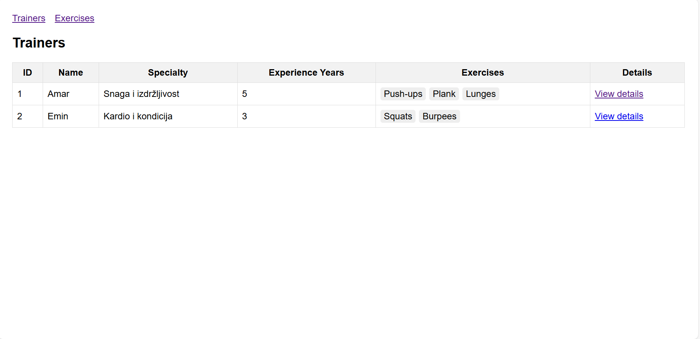
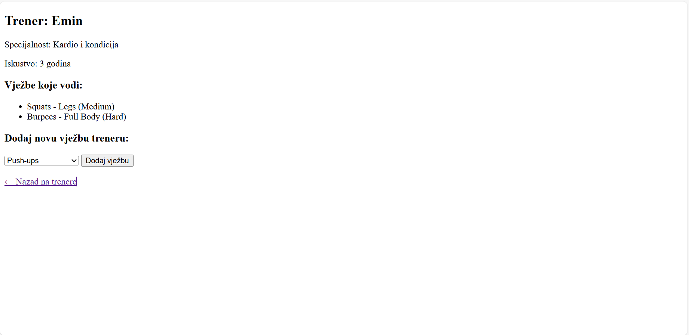
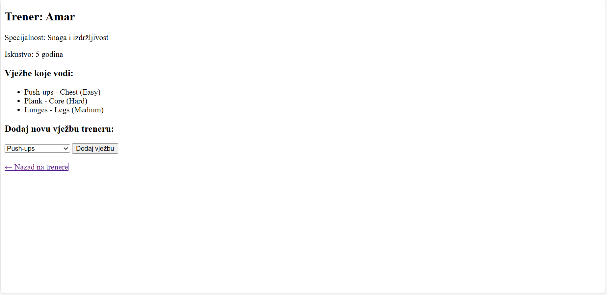
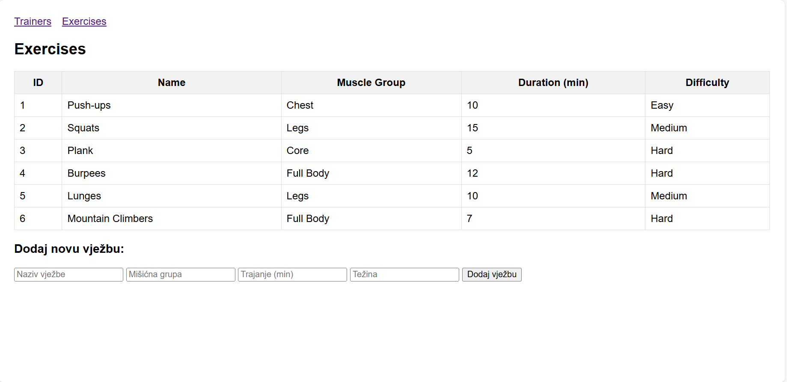

# Fitnes aplikacija

Emina Kaknjo, Amina Bojić

## Opis projekta
Fitness aplikacija omogućava pregled i upravljanje trenerima i njihovim vježbama.  
Glavne funkcionalnosti:
- Lista svih trenera i detalji o svakom treneru
- Pregled svih vježbi i dodavanje novih
- Dodavanje postojećih vježbi treneru
- Aplikacija radi sa in-memory podacima (bez baze) putem `DemoData.java`

### Modeli
1. **Trainer**
    - `id` – jedinstveni identifikator
    - `name` – ime trenera
    - `specialty` – specijalnost trenera
    - `experienceYears` – godine iskustva
    - `exercises` – lista vježbi koje trener vodi

2. **Exercise**
    - `id` – jedinstveni identifikator
    - `name` – naziv vježbe
    - `muscleGroup` – ciljna mišićna grupa
    - `durationMinutes` – trajanje vježbe u minutama
    - `difficulty` – težina vježbe 

### Relacija
- **1:N**: Jedan trener (`Trainer`) može imati više vježbi (`Exercise`)
- Veza je prikazana u view-u na stranici detalja trenera (`trainer-details.html`)

## Kontroleri i GET rute
1. `/trainers` – prikaz liste svih trenera (`trainers.html`)
2. `/trainer/{id}` – detalji jednog trenera i forma za dodavanje vježbi (`trainer-details.html`)
3. `/exercises` – prikaz liste svih vježbi i forma za dodavanje novih (`exercises.html`)
4. `/` – početna ruta koja preusmjerava na `/trainers`

## HTML stranice
- `trainers.html` – lista trenera
- `trainer-details.html` – detalji jednog trenera + dodavanje postojećih vježbi
- `exercises.html` – lista vježbi i dodavanje novih

## Screenshot aplikacije

### Lista trenera

### Detalji trenera - prikaz 1

### Detalji trenera - prikaz 2

### Lista vježbi

## Tehnologije
- Java 17
- Spring Boot 3.x
- Thymeleaf
- Maven  

## Uputstvo za pokretanje

1. **Kloniraj repozitorij**:
git clone https://github.com/Emina-1/fitnes-ap.git
2. Otvori projekat u IntelliJ IDEA ili drugom IDE-u koji podržava Spring Boot.
3. Pokreni Maven build
4. Iz IDE-a pokreni glavnu klasu FitnessApplication.java
5. Pristup aplikaciji putem http://localhost:8080

##Podjela zadataka:
Emina - model Trainer, rute za prikaz svih Trainer objekata i detalja jednog trenera, trainers.html
Amina - model Exercise, rute, exercises.html
Zajedno - akcija u kontroleru, trainer-details.html

