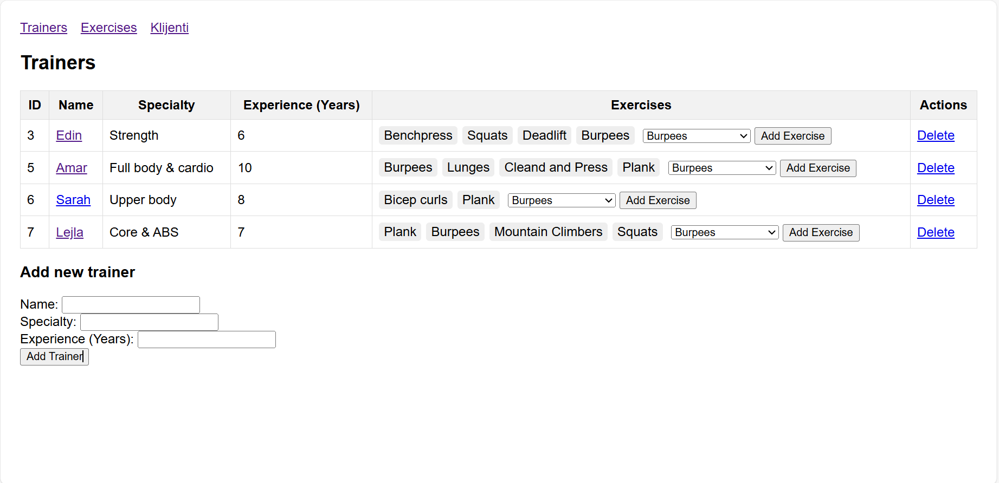
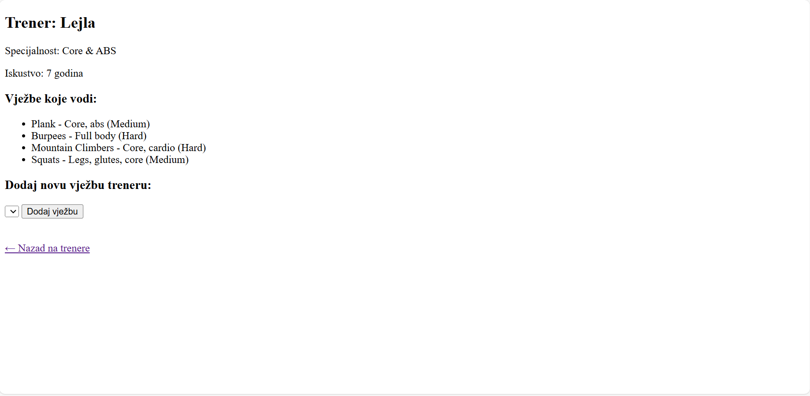
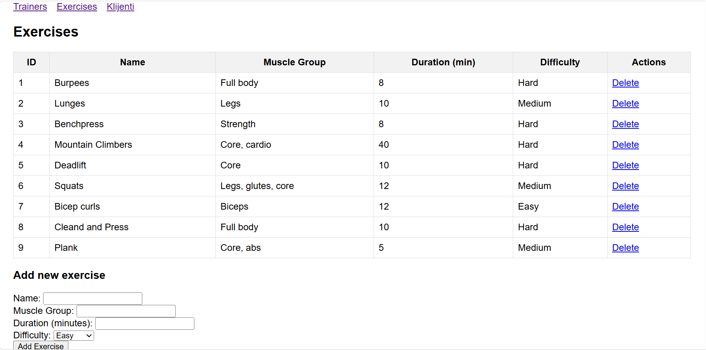
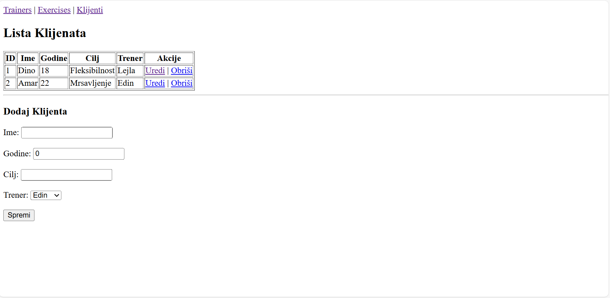

# Fitnes aplikacija

Emina Kaknjo, Amina Bojić

## Opis projekta
Fitness aplikacija omogućava pregled i upravljanje trenerima, njihovim vježbama i klijentima.  
Glavne funkcionalnosti:
- Lista svih trenera i detalji o svakom treneru
- Pregled svih vježbi i dodavanje novih
- Dodavanje postojećih vježbi treneru
- Lista svih klijenata (novi model), dodavanje novih, uređivanje i brisanje psotojećih

## Modeli i relacije
1. **Trainer**
    - `id` – jedinstveni identifikator
    - `name` – ime trenera
    - `specialty` – specijalnost trenera
    - `experienceYears` – godine iskustva
    - `exercises` – lista vježbi koje trener vodi

2. **Exercise**
    - `id` – jedinstveni identifikator
    - `name` – naziv vježbe
    - `muscleGroup` – ciljna mišićna grupa
    - `durationMinutes` – trajanje vježbe u minutama
    - `difficulty` – težina vježbe
- Relacija **Exercise-Trainer (Many-to-many)**: Jedan trener (`Trainer`) može imati više vježbi (`Exercise`) i obratno. Veza je prikazana u view-u na stranici detalja trenera (`trainer-details.html`)

3. **Client-NOVI MODEL**
   - `id` – jedinstveni identifikator
   - `name` – ime klijenta
   - `age` – godine
   - `goal` – cilj treninga
   - `trainer` – trener
- Relacija **Client-Trainer (Many-to-one)**: Jedan klijent može imati samo jednog trenera a jedan trener ima više klijenata.

## Opis logike dodavanja novog modela i ostvarene relacije

Dodan je novi model Client koji ima svoje atribute i povezan je s modelom Trainer relacijom Many-to-one.

Relacija Many-to-One omogućava jednostavno praćenje kojem treneru klijent pripada, a MVC i REST kontrolleri omogućavaju korisnički unos i integraciju s vanjskim aplikacijama.

### Client Controller funkcionalnosti
Ovaj kontroler omogućava rad s modelom Client putem Thymeleaf prikaza i standardnih web formi:

- GET /clients – prikazuje listu svih klijenata i formu za dodavanje novog klijenta (clients.html).
- POST /clients/save – sprema novog klijenta, povezujući ga s trenerom po odabranom trainerId.
- GET /clients/edit/{id} – prikazuje formu za uređivanje postojećeg klijenta (clients.html).
- POST /clients/update/{id} – ažurira podatke postojećeg klijenta i njegovog trenera.
- GET /clients/delete/{id} – briše klijenta po ID-u.

### RestController
Ovaj kontroler omogućava rad s modelom Client putem REST API-ja, vraćajući JSON podatke:

- GET /api/clients – vraća listu svih klijenata.
- GET /api/clients/{id} – vraća jednog klijenta po ID-u.
- POST /api/clients – dodaje novog klijenta (prima JSON objekt).
- PUT /api/clients/{id} – ažurira postojećeg klijenta po ID-u (prima JSON objekt).
- DELETE /api/clients/{id} – briše klijenta po ID-u

## Izmjene u ostalim controllerima
Prijašnji AppController služio je kao jedini kontroler za prikaz stranica i rukovanje podacima o trenerima i vježbama.

Novi MVC kontroleri:
- **TrainerController** – upravljanje trenerima i njihovim vježbama putem web formi (Thymeleaf):
  - GET /trainers – prikazuje listu svih trenera i dostupne vježbe
  - GET /trainers/{id} – prikazuje detalje jednog trenera (trainer-details.html)
  - POST /trainers/add – dodaje novog trenera
  - GET /trainers/delete/{id} – briše trenera
  - POST /trainers/addExercise – dodaje postojeću vježbu treneru
- **ExerciseController** – upravljanje vježbama putem web formi:
  - GET /exercises – prikazuje listu svih vježbi (exercises.html)
  - POST /exercises/add – dodaje novu vježbu
  - GET /exercises/delete/{id} – briše vježbu

Novi REST kontroleri:
- **TrainerRestController** – CRUD operacije nad trenerima i njihovim vježbama:
  - GET /api/trainers – vraća listu svih trenera u JSON formatu
  - GET /api/trainers/{id} – vraća jednog trenera po ID-u
  - POST /api/trainers – dodaje novog trenera
  - PUT /api/trainers/{id} – ažurira postojećeg trenera
  - DELETE /api/trainers/{id} – briše trenera
  - POST /api/trainers/{trainerId}/exercises/{exerciseId} – dodaje postojeću vježbu treneru
- **ExerciseRestController** – CRUD operacije nad vježbama:
  - GET /api/exercises – vraća listu svih vježbi
  - GET /api/exercises/{id} – vraća jednu vježbu po ID-u
  - POST /api/exercises – dodaje novu vježbu
  - PUT /api/exercises/{id} – ažurira postojeću vježbu
  - DELETE /api/exercises/{id} – briše vježbu.

Novi AppController služi isključivo za preusmjeravanje početne rute na /trainers.

## Service sloj
U aplikaciju je dodan service sloj za pristup bazi preko JPA repozitorija. Svaki model ima svoj servis:
- **TrainerService**
    - findAll() – vraća listu svih trenera
    - findById(Long id) – vraća trenera po ID-u 
    - save(Trainer trainer) – sprema ili ažurira trenera 
    - delete(Long id) – briše trenera po ID-u 
- **ExerciseService**
  - findAll() – vraća listu svih vježbi 
  - findById(Long id) – vraća vježbu po ID-u 
  - save(Exercise exercise) – sprema ili ažurira vježbu 
  - delete(Long id) – briše vježbu po ID-u
- **ClientService**
  - findAll() – vraća listu svih klijenata 
  - findById(Long id) – vraća klijenta po ID-u 
  - save(Client client) – sprema ili ažurira klijenta 
  - deleteById(Long id) – briše klijenta po ID-u

Servisi se koriste unutar MVC kontrolera i REST kontrolera kako bi se omogućio pristup bazi podataka i izvršavanje CRUD operacija na entitetima.

## Konfiguracija baze
Ovaj projekat koristi MySQL bazu podataka za pohranu podataka o trenerima, klijentima i vježbama.
U application.properties fajlu konfigurisan je pristup MySQL bazi:
- `spring.datasource.url=jdbc:mysql://localhost:3306/fitness_db?useSSL=false&serverTimezone=UTC` – URL baze 
- `spring.datasource.username=root` – korisničko ime baze 
- `spring.datasource.password=root` – lozinka baze 
- `spring.jpa.hibernate.ddl-auto=update` – automatsko kreiranje i ažuriranje tablica

Projekt koristi JPA entitete za kreiranje i mapiranje tablica:
- Trainer – tablica trainer (sadrži sve atribute trenera i listu vježbi, relacija Many-to-Many prema Exercise)
- Client – tablica client (sadrži atribute klijenta i povezani trener, relacija Many-to-One prema Trainer)
- Exercise – tablica exercise (sadrži atribute vježbe, relacija Many-to-Many prema Trainer)

Relacije su definirane u entitetima koristeći JPA anotacije (@ManyToOne, @ManyToMany) i omogućavaju automatsko održavanje veza između tablica prilikom CRUD operacija.

## HTML stranice
- `trainers.html` – lista trenera i dodavanje novog trenera
- `trainer-details.html` – detalji jednog trenera, dodavanje postojećih vježbi
- `exercises.html` – lista vježbi i dodavanje novih
- `clients.html` - list svih klijenata, dodavanje novih, uređivanje i brisanje postojećih

## Screenshot aplikacije

### Lista trenera

### Detalji trenera

### Lista vježbi

### Lista klijenata

## Tehnologije
- Java 17
- Spring Boot 3.x
- Thymeleaf
- Maven  

## Uputstvo za pokretanje

1. **Kloniraj repozitorij**:
git clone https://github.com/Emina-1/fitnes-ap.git
2. Otvori projekat u IntelliJ IDEA ili drugom IDE-u koji podržava Spring Boot.
3. Pokreni Maven build
4. Iz IDE-a pokreni glavnu klasu FitnessApplication.java
5. Pristup aplikaciji putem http://localhost:8080

